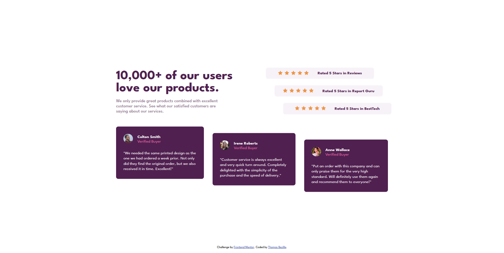
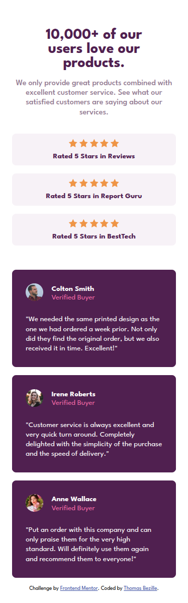

# Social proof section

> Le challenge Social Proof Section de Frontend Mentor est un exercice de niveau newbie qui consiste à reproduire une section de preuves sociales comprenant des avis clients et des témoignages. Ce type de section est très courant dans le monde du web, notamment sur les pages de vente et les landing pages. L'exercice met l'accent sur la maîtrise de CSS Grid pour créer un layout complexe avec des éléments décalés, ainsi que sur le responsive design pour adapter l'affichage sur mobile et desktop. C'est un challenge idéal pour progresser en intégration web et apprendre à gérer des mises en page asymétriques.

**🔗 [Demo en ligne](https://exemple.com)**

---

## 🎯 Objectif

Ce challenge a été réalisé dans le cadre de ma progression en développement frontend. Il consiste à reproduire fidèlement une section de preuves sociales (témoignages et avis clients) responsive à partir d'un design fourni par Frontend Mentor. Ce projet a été réalisé avec HTML5 et SCSS afin de consolider mes compétences en intégration web et en mise en page avancée.

**Les compétences que j'ai du utiliser :**

- Structure sémantique HTML5
- Utilisation de SCSS
- Mise en page avec CSS Grid (`grid-template-columns`, `grid-template-areas`)
- Mise en page avec Flexbox (`align-items`, `justify-content`, `gap`)
- Positionnement des éléments (`position: relative`, `position: absolute`)
- Gestion des images circulaires (`border-radius: 50%`)
- Décalage des éléments avec `margin` et `transform: translate()`
- Typographie (`font-size`, `font-weight`, `line-height`, `letter-spacing`)
- Gestion des couleurs avec les variables SCSS
- Responsive design et approche mobile-first
- Utilisation des media queries pour adapter le layout
- Débogage et test sur différentes résolutions avec les DevTools

---

## 🛠️ Stack

---

## 👤 Contact

**Thomas Bezille** — Développeur web à Nantes

